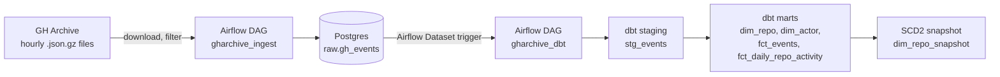
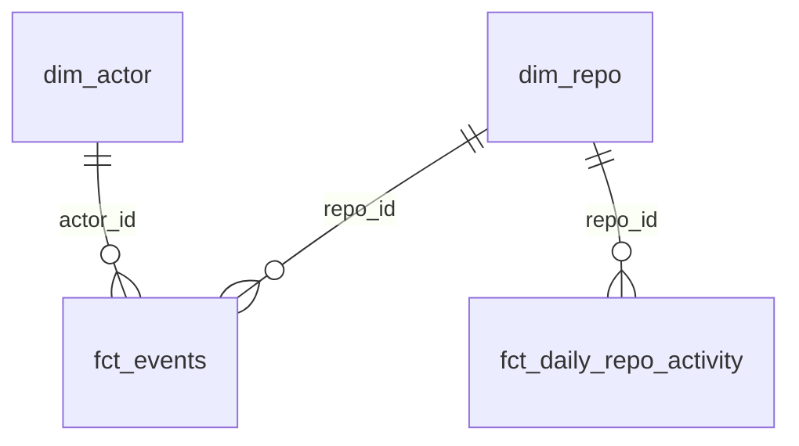
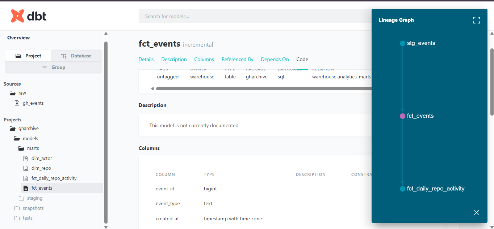

# GH Archive Analytics Pipeline

[](https://github.com/MAsimKhan29503/gharchive-pipeline/actions/workflows/ci.yml)

An end-to-end, fully open-source data engineering project. It downloads GitHub's public event logs every hour, stores them raw in Postgres, and uses dbt to turn them into tested, analytics-ready tables, all orchestrated by Airflow and reproducible with a single `docker compose up`.

Built with **Airflow, dbt, PostgreSQL, Docker, and GitHub Actions**. No cloud account needed.

## Architecture




## What it does

1. **Ingest (hourly):** `gharchive_ingest` downloads one GH Archive file per hour, keeps five event types (push, pull request, issues, watch/star, fork), and loads the raw JSON into `raw.gh_events` as JSONB.
2. **Transform (data-aware):** when ingestion updates the raw table, Airflow's Dataset feature triggers `gharchive_dbt`, which checks source freshness, runs `dbt build` (models and tests), then runs `dbt snapshot`.
3. **Serve:** analysts query a small star schema instead of raw JSON.

## Tech stack

| Layer | Tool |
|---|---|
| Orchestration | Apache Airflow 2.10 (LocalExecutor) |
| Storage / warehouse | PostgreSQL 16 |
| Transformation and testing | dbt-core 1.8 with dbt-postgres |
| Packaging | Docker and Docker Compose |
| CI | GitHub Actions |
| Language | Python 3.11, SQL |

## Data model



| Model | Type | Description |
|---|---|---|
| `stg_events` | view | Raw JSON unpacked into typed columns |
| `dim_repo` | table | One row per repo, with its latest name |
| `dim_actor` | table | One row per GitHub user, with an `is_bot` flag |
| `fct_events` | incremental table | One row per event; only new rows are processed on each run |
| `fct_daily_repo_activity` | table | Events, stars, forks, and unique human and bot actors per repo per day |
| `dim_repo_snapshot` | snapshot (SCD Type 2) | Full history of repo names, so renames are never lost |



## Engineering decisions

- **Idempotent loads:** each hourly run deletes the rows of its own file before reinserting them, so retries and backfills never create duplicates (verified by re-running loads and checking row counts).
- **Backfill and retries:** `catchup=True` loads history automatically, and retries cover the delay before GH Archive publishes the latest hour.
- **Dataset-triggered transforms:** dbt runs when new data actually lands, not on a guessed schedule. `max_active_runs=1` keeps two dbt jobs from colliding on the same tables.
- **Incremental fact table:** `fct_events` only processes rows loaded since the last run and uses `unique_key` so reloaded hours replace their old rows.
- **Isolated dbt environment:** dbt lives in its own virtualenv inside the Airflow image, because its dependencies conflict with Airflow's. Exact versions are pinned.
- **Separate databases:** Airflow's metadata database is separate from the analytics warehouse.

## Data quality

- Column tests (`not_null`, `unique`, `accepted_values`, `relationships`) and a custom SQL test for the two-column key of the daily table.
- Source freshness check: warns after 6 hours and errors after 24 hours without new data.
- **A real finding:** a `not_null` test on `repo_id` flagged 14 events out of about 2 million. Tracing them to the raw JSON showed GitHub sends `"repo": {}` for some ForkEvents (likely private or deleted source repos). I kept them in staging, set that test to `warn` so it stays visible without blocking the pipeline, and exclude them from the marts.
- CI runs `dbt build` against a clean Postgres with sample data on every push.

## Run it locally

Requirements: Docker Desktop (about 4 GB of memory available for Docker).

```bash
git clone https://github.com/MAsimKhan29503/gharchive-pipeline.git
cd gharchive-pipeline

cp .env.example .env              # on Windows PowerShell: copy .env.example .env

docker compose build
docker compose up airflow-init    # one-time setup, wait for it to exit
docker compose up -d
```

- Airflow UI: http://localhost:8080 (login `admin` / `admin`)
- Warehouse from your machine: `localhost:5433` (credentials from `.env`)

In the UI, switch on `gharchive_ingest` (it backfills from its `start_date`) and `gharchive_dbt`. The dbt DAG starts by itself after ingestion runs.

Run dbt manually:

```bash
docker compose exec airflow-scheduler bash -c "cd /opt/airflow/dbt && /home/airflow/dbt_venv/bin/dbt build"
```

## Example query

Repos with the most distinct human contributors per day:

```sql
SELECT d.repo_name, f.event_date, f.unique_human_actors
FROM analytics_marts.fct_daily_repo_activity f
JOIN analytics_marts.dim_repo d USING (repo_id)
ORDER BY f.unique_human_actors DESC
LIMIT 10;
```

## Project structure

```
.
├── dags/
│   ├── gharchive_ingest.py      # hourly download and load into raw.gh_events
│   └── gharchive_dbt.py         # freshness, build, snapshot (Dataset-triggered)
├── dbt/
│   ├── dbt_project.yml
│   ├── profiles.yml
│   ├── models/
│   │   ├── staging/             # stg_events, sources, tests
│   │   └── marts/               # dimensions, facts, tests
│   ├── snapshots/               # SCD2 snapshot of repo names
│   └── tests/                   # custom SQL tests
├── init/01_raw_schema.sql       # raw table, created on first boot
├── ci/seed.sql                  # sample events for CI
├── scripts/load_hour.py         # manual loader (used while building the DAG)
├── .github/workflows/ci.yml
├── Dockerfile                   # Airflow image plus isolated dbt
└── docker-compose.yml
```

## Possible next steps

- Add a Metabase dashboard on top of the marts.
- Run the same dbt project against Snowflake to show warehouse portability.
- Alert on failed tests (Slack or email) from Airflow.